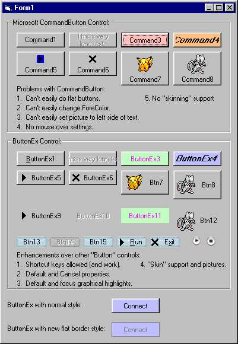



## ButtonEx v1\.2

### Description

Updated version of ButtonEx control replacement for CommandButton. Added BorderStyle property. Using BorderStyle and Appearance you can get lots of different combinations.

Provides more control over the pictures displayed when mouse down, mouse up, mouse over and has focus. Provides "skin" support alongside of picture support. Did you ever wonder how WinAmp and other programs make the button "glow" when you move your mouse over them or press them? ButtonEx provides that through "skins" for each individual button state (up, over, down, focus, disabled).
 
### More Info
 

             |
---                |---
**Submitted On**   |2001-07-08 19:27:18
**By**             |[Nightshadow](https://github.com/Planet-Source-Code/PSCIndex/blob/master/ByAuthor/nightshadow.md)
**Level**          |Intermediate
**User Rating**    |4.9 (136 globes from 28 users)
**Compatibility**  |VB 6\.0
**Category**       |[Custom Controls/ Forms/  Menus](https://github.com/Planet-Source-Code/PSCIndex/blob/master/ByCategory/custom-controls-forms-menus__1-4.md)
**World**          |[Visual Basic](https://github.com/Planet-Source-Code/PSCIndex/blob/master/ByWorld/visual-basic.md)
**Archive File**   |[ButtonEx v22424782001\.zip](https://github.com/Planet-Source-Code/nightshadow-buttonex-v1-2__1-24833/archive/master.zip)

